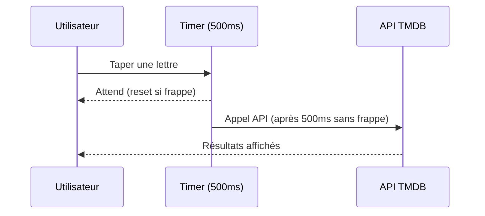

# MoodFlix

MoodFlix est une application **React + Vite** qui permet de rechercher et d’explorer des films en temps réel, tout en optimisant les appels API grâce à un système de **debouncing**.

L’objectif est simple : offrir une expérience fluide et rapide pour trouver les films que vous aimez, sans surcharger l’API avec des requêtes inutiles.

---

## Fonctionnalités

- Recherche de films via **The Movie Database (TMDB)**
- Liste de films populaires par défaut
- Affichage des résultats sous forme de cartes (**MovieCard**)
- Gestion des erreurs et affichage de messages d’erreur
- **Debouncing** sur la recherche pour éviter les appels API trop fréquents
- Loader animé (**Spinners**) pendant le chargement des données

---

## Technologies utilisées

- **React + Vite** – Frontend rapide et moderne
- **Tailwind CSS** – Pour un design simple et responsive
- **react-use** – Pour le hook `useDebounce`
- **TMDB API** – Source principale des données sur les films

---

## API utilisée

L’application utilise l’API de **The Movie Database (TMDB)**.<br>
Un token Bearer est utilisé pour l’authentification et est stocké dans un fichier `.env` :

```env
VITE_TMDB_API_KEY=VOTRE_TOKEN_ICI
```

Dans le code, l’API est appelée avec :

```js
const API_BASE_URL = 'https://api.themoviedb.org/3';
const API_OPTIONS = {
  method: 'GET',
  headers: {
    accept: 'application/json',
    Authorization: `Bearer ${import.meta.env.VITE_TMDB_API_KEY}`
  }
}
```

L’application utilise deux endpoints principaux :
- **Recherche de film** : `/search/movie?query=...`
- **Films populaires** : `/discover/movie?sort_by=popularity.desc`

---

## Debouncing (Optimisation de la recherche)

Pour éviter de faire une requête API à chaque frappe de l’utilisateur, l’application utilise le hook `useDebounce` de la librairie **react-use**.

**Principe :**
- L’utilisateur tape un mot-clé dans la barre de recherche
- Attente de 500ms après la dernière frappe avant de déclencher l’appel API
- Si l’utilisateur continue à taper avant 500ms, le timer se réinitialise

Cela permet :
- D’économiser des appels API
- D’améliorer les performances
- De réduire le risque de blocage dû à un trop grand nombre de requêtes

**Extrait de code :**

```js
const [debouncedSearchTerm, setDebouncedSearchTerm] = useState('');

useDebounce(() => setDebouncedSearchTerm(searchTerm), 500, [searchTerm]);

useEffect(() => {
  fetchMovies(debouncedSearchTerm);
}, [debouncedSearchTerm]);
```

---

## Schéma du fonctionnement du debouncing

```
Frappe utilisateur → [Timer 500ms] → (Si nouvelles frappes, timer réinitialisé) → [Appel API]
```



---

## Installation et Lancement

1. **Cloner le projet**
    ```bash
    git clone https://github.com/ton-pseudo/moodflix.git
    cd moodflix
    ```

2. **Installer les dépendances**
    ```bash
    npm install
    ```

3. **Configurer votre clé TMDB**  
   Créer un fichier `.env` à la racine du projet :
    ```
    VITE_TMDB_API_KEY=VOTRE_CLE_TMDB
    ```

4. **Lancer le projet en développement**
    ```bash
    npm run dev
    ```


- Pagination ou infinite scroll
- Système de favoris

---
